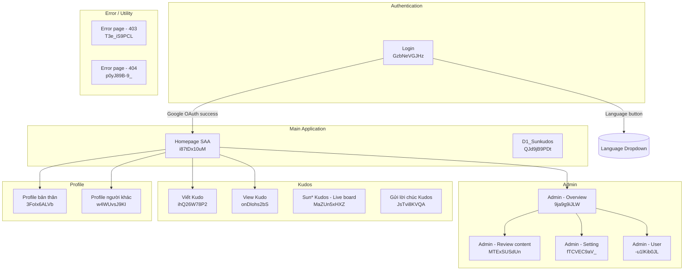
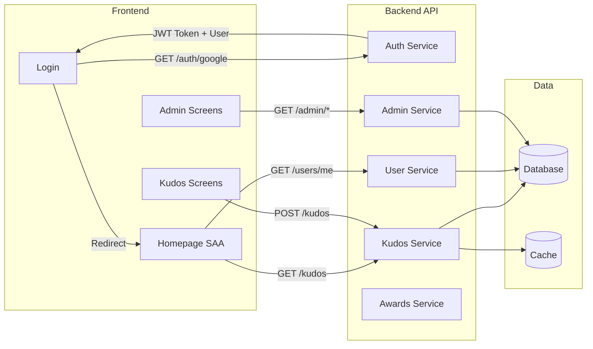

# Screen Flow Overview

## Project Info
- **Project Name**: SAA (Sun* Asterisk Awards)
- **Figma File Key**: 9ypp4enmFmdK3YAFJLIu6C
- **Figma URL**: https://www.figma.com/design/9ypp4enmFmdK3YAFJLIu6C
- **Created**: 2026-05-07
- **Last Updated**: 2026-05-07

---

## Discovery Progress

| Metric | Count |
|--------|-------|
| Total Screens | 38 |
| Discovered | 1 |
| Remaining | 37 |
| Completion | 3% |

---

## Screens

| # | Screen Name | Frame ID | Figma Link | Status | Detail File | Predicted APIs | Navigations To |
|---|-------------|----------|------------|--------|-------------|----------------|----------------|
| 1 | Login | GzbNeVGJHz | [Link](https://www.figma.com/design/9ypp4enmFmdK3YAFJLIu6C?node-id=662:14387) | discovered | [login.md](screen_specs/login.md) | `GET /auth/status`, `GET /auth/google`, `GET /auth/google/callback` | Homepage SAA, Language Dropdown |
| 2 | Homepage SAA | i87tDx10uM | [Link](https://www.figma.com/design/9ypp4enmFmdK3YAFJLIu6C?node-id=i87tDx10uM) | pending | — | `GET /users/me`, `GET /kudos` | — |
| 3 | D1_Sunkudos | QJd9jB9PDt | [Link](https://www.figma.com/design/9ypp4enmFmdK3YAFJLIu6C?node-id=QJd9jB9PDt) | pending | — | `GET /kudos` | — |
| 4 | Admin - Overview | 9ja9g9iJLW | [Link](https://www.figma.com/design/9ypp4enmFmdK3YAFJLIu6C?node-id=9ja9g9iJLW) | pending | — | `GET /admin/stats` | — |
| 5 | Admin - Review content | MTExSUSdUn | [Link](https://www.figma.com/design/9ypp4enmFmdK3YAFJLIu6C?node-id=MTExSUSdUn) | pending | — | `GET /admin/kudos`, `PUT /admin/kudos/:id` | — |
| 6 | Admin - Review content - Search | kO5qYafrMh | [Link](https://www.figma.com/design/9ypp4enmFmdK3YAFJLIu6C?node-id=kO5qYafrMh) | pending | — | `GET /admin/kudos?search=` | — |
| 7 | Admin - Setting | fTCVEC9aV_ | [Link](https://www.figma.com/design/9ypp4enmFmdK3YAFJLIu6C?node-id=fTCVEC9aV_) | pending | — | `GET /admin/settings` | — |
| 8 | Admin - Setting - add Campaign | cb7kD3-Xr6 | [Link](https://www.figma.com/design/9ypp4enmFmdK3YAFJLIu6C?node-id=cb7kD3-Xr6) | pending | — | `POST /campaigns` | — |
| 9 | Admin - Setting - add new Campaign | FVA7A5f8z8 | [Link](https://www.figma.com/design/9ypp4enmFmdK3YAFJLIu6C?node-id=FVA7A5f8z8) | pending | — | `POST /campaigns` | — |
| 10 | Admin - Setting - Edit Campaign | htgRaDTO2f | [Link](https://www.figma.com/design/9ypp4enmFmdK3YAFJLIu6C?node-id=htgRaDTO2f) | pending | — | `GET /campaigns/:id`, `PUT /campaigns/:id` | — |
| 11 | Admin - User | -u1lKib0JL | [Link](https://www.figma.com/design/9ypp4enmFmdK3YAFJLIu6C?node-id=-u1lKib0JL) | pending | — | `GET /admin/users`, `PUT /admin/users/:id` | — |
| 12 | Profile bản thân | 3FoIx6ALVb | [Link](https://www.figma.com/design/9ypp4enmFmdK3YAFJLIu6C?node-id=3FoIx6ALVb) | pending | — | `GET /users/me` | — |
| 13 | Profile người khác | w4WUvsJ9KI | [Link](https://www.figma.com/design/9ypp4enmFmdK3YAFJLIu6C?node-id=w4WUvsJ9KI) | pending | — | `GET /users/:id` | — |
| 14 | Viết Kudo | ihQ26W78P2 | [Link](https://www.figma.com/design/9ypp4enmFmdK3YAFJLIu6C?node-id=ihQ26W78P2) | pending | — | `POST /kudos` | — |
| 15 | View Kudo | onDIohs2bS | [Link](https://www.figma.com/design/9ypp4enmFmdK3YAFJLIu6C?node-id=onDIohs2bS) | pending | — | `GET /kudos/:id` | — |
| 16 | Sun* Kudos - Live board | MaZUn5xHXZ | [Link](https://www.figma.com/design/9ypp4enmFmdK3YAFJLIu6C?node-id=MaZUn5xHXZ) | pending | — | `GET /kudos/live` | — |
| 17 | Gửi lời chúc Kudos | JsTvi8KVQA | [Link](https://www.figma.com/design/9ypp4enmFmdK3YAFJLIu6C?node-id=JsTvi8KVQA) | pending | — | `POST /kudos` | — |
| 18 | Hệ thống giải | zFYDgyj_pD | [Link](https://www.figma.com/design/9ypp4enmFmdK3YAFJLIu6C?node-id=zFYDgyj_pD) | pending | — | `GET /awards` | — |
| 19 | Danh hiệu | DS7D7-HrIY | [Link](https://www.figma.com/design/9ypp4enmFmdK3YAFJLIu6C?node-id=DS7D7-HrIY) | pending | — | `GET /awards/:id` | — |
| 20 | Tất cả thông báo | 6-1LRz3vqr | [Link](https://www.figma.com/design/9ypp4enmFmdK3YAFJLIu6C?node-id=6-1LRz3vqr) | pending | — | `GET /notifications` | — |
| 21 | Award | TfCh7y1S-D | [Link](https://www.figma.com/design/9ypp4enmFmdK3YAFJLIu6C?node-id=TfCh7y1S-D) | pending | — | `GET /awards/:id` | — |
| 22 | Countdown - Prelaunch page | 8PJQswPZmU | [Link](https://www.figma.com/design/9ypp4enmFmdK3YAFJLIu6C?node-id=8PJQswPZmU) | pending | — | — | — |
| 23 | Ẩn danh | p9vFVBE_tc | [Link](https://www.figma.com/design/9ypp4enmFmdK3YAFJLIu6C?node-id=p9vFVBE_tc) | pending | — | — | — |
| 24 | Error page - 403 | T3e_iS9PCL | [Link](https://www.figma.com/design/9ypp4enmFmdK3YAFJLIu6C?node-id=T3e_iS9PCL) | pending | — | — | — |
| 25 | Error page - 404 | p0yJ89B-9_ | [Link](https://www.figma.com/design/9ypp4enmFmdK3YAFJLIu6C?node-id=p0yJ89B-9_) | pending | — | — | — |
| 26 | [iOS] Login | 8HGlvYGJWq | [Link](https://www.figma.com/design/9ypp4enmFmdK3YAFJLIu6C?node-id=8HGlvYGJWq) | pending | — | `GET /auth/google`, `GET /auth/google/callback` | — |
| 27 | [iOS] Home | OuH1BUTYT0 | [Link](https://www.figma.com/design/9ypp4enmFmdK3YAFJLIu6C?node-id=OuH1BUTYT0) | pending | — | `GET /users/me`, `GET /kudos` | — |
| 28 | [iOS] Profile bản thân | hSH7L8doXB | [Link](https://www.figma.com/design/9ypp4enmFmdK3YAFJLIu6C?node-id=hSH7L8doXB) | pending | — | `GET /users/me` | — |
| 29 | [iOS] Profile người khác | bEpdheM0yU | [Link](https://www.figma.com/design/9ypp4enmFmdK3YAFJLIu6C?node-id=bEpdheM0yU) | pending | — | `GET /users/:id` | — |
| 30 | [iOS] Sun*Kudos | fO0Kt19sZZ | [Link](https://www.figma.com/design/9ypp4enmFmdK3YAFJLIu6C?node-id=fO0Kt19sZZ) | pending | — | `GET /kudos` | — |
| 31 | [iOS] Sun*Kudos_All Kudos | j_a2GQWKDJ | [Link](https://www.figma.com/design/9ypp4enmFmdK3YAFJLIu6C?node-id=j_a2GQWKDJ) | pending | — | `GET /kudos` | — |
| 32 | [iOS] Sun*Kudos_Gửi lời chúc Kudos | PV7jBVZU1N | [Link](https://www.figma.com/design/9ypp4enmFmdK3YAFJLIu6C?node-id=PV7jBVZU1N) | pending | — | `POST /kudos` | — |
| 33 | [iOS] Sun*Kudos_Viết Kudo_default | 7fFAb-K35a | [Link](https://www.figma.com/design/9ypp4enmFmdK3YAFJLIu6C?node-id=7fFAb-K35a) | pending | — | `POST /kudos` | — |
| 34 | [iOS] Sun*Kudos_View kudo | T0TR16k0vH | [Link](https://www.figma.com/design/9ypp4enmFmdK3YAFJLIu6C?node-id=T0TR16k0vH) | pending | — | `GET /kudos/:id` | — |
| 35 | [iOS] Thể lệ | zIuFaHAid4 | [Link](https://www.figma.com/design/9ypp4enmFmdK3YAFJLIu6C?node-id=zIuFaHAid4) | pending | — | — | — |
| 36 | [iOS] Access denied | k-7zJk2B7s | [Link](https://www.figma.com/design/9ypp4enmFmdK3YAFJLIu6C?node-id=k-7zJk2B7s) | pending | — | — | — |
| 37 | [iOS] Not Found | sn2mdavs1a | [Link](https://www.figma.com/design/9ypp4enmFmdK3YAFJLIu6C?node-id=sn2mdavs1a) | pending | — | — | — |
| 38 | [iOS] Open secret box | kQk65hSYF2 | [Link](https://www.figma.com/design/9ypp4enmFmdK3YAFJLIu6C?node-id=kQk65hSYF2) | pending | — | — | — |

---

## Navigation Graph

---

## Screen Groups

### Group: Authentication
| Screen | Purpose | Entry Points |
|--------|---------|--------------|
| Login | Google SSO entry point | App launch, session expiry |
| [iOS] Login | Mobile Google SSO entry point | iOS app launch |

### Group: Main Application
| Screen | Purpose | Entry Points |
|--------|---------|--------------|
| Homepage SAA | Main hub — Kudos feed + stats | After login |
| D1_Sunkudos | Sunkudos dashboard | Homepage nav |
| Sun* Kudos - Live board | Live leaderboard/board | Homepage nav |

### Group: Kudos
| Screen | Purpose | Entry Points |
|--------|---------|--------------|
| Viết Kudo | Write/compose a Kudo | Homepage FAB / button |
| Gửi lời chúc Kudos | Send a Kudo message | Compose flow |
| View Kudo | View detail of a Kudo | Feed item click |

### Group: Profile
| Screen | Purpose | Entry Points |
|--------|---------|--------------|
| Profile bản thân | Own profile page | Avatar / header |
| Profile người khác | Other user's profile | User mention / avatar click |

### Group: Awards
| Screen | Purpose | Entry Points |
|--------|---------|--------------|
| Hệ thống giải | Awards system overview | Homepage nav |
| Danh hiệu | Award/title detail | Awards list |
| Award | Award detail | Awards list |

### Group: Admin
| Screen | Purpose | Entry Points |
|--------|---------|--------------|
| Admin - Overview | Admin dashboard | Admin nav |
| Admin - Review content | Moderate Kudos content | Admin nav |
| Admin - Review content - Search | Search Kudos for review | Admin - Review content |
| Admin - Setting | System settings & campaigns | Admin nav |
| Admin - Setting - add Campaign | Add campaign form | Admin - Setting |
| Admin - Setting - add new Campaign | Add new campaign form | Admin - Setting |
| Admin - Setting - Edit Campaign | Edit campaign form | Admin - Setting |
| Admin - User | Manage users | Admin nav |

### Group: Notifications
| Screen | Purpose | Entry Points |
|--------|---------|--------------|
| Tất cả thông báo | All notifications list | Notification bell |

### Group: Error / Utility
| Screen | Purpose | Entry Points |
|--------|---------|--------------|
| Countdown - Prelaunch page | Pre-launch waiting page | Root redirect (pre-launch) |
| Ẩn danh | Anonymous mode screen | Anonymous feature |
| Error page - 403 | Forbidden access | Auth guard |
| Error page - 404 | Not found | Invalid route |

### Group: iOS Screens
| Screen | Purpose | Entry Points |
|--------|---------|--------------|
| [iOS] Login | Mobile login | iOS app launch |
| [iOS] Home | Mobile home feed | After mobile login |
| [iOS] Profile bản thân | Mobile own profile | Mobile nav |
| [iOS] Profile người khác | Mobile other profile | Mobile user click |
| [iOS] Sun*Kudos | Mobile Kudos list | Mobile nav |
| [iOS] Sun*Kudos_All Kudos | All Kudos (mobile) | Mobile nav |
| [iOS] Sun*Kudos_Gửi lời chúc Kudos | Mobile send Kudo | Mobile compose |
| [iOS] Sun*Kudos_Viết Kudo_default | Mobile write Kudo | Mobile compose |
| [iOS] Sun*Kudos_View kudo | Mobile Kudo detail | Mobile feed |
| [iOS] Thể lệ | iOS rules/terms | Mobile nav |
| [iOS] Open secret box | Open secret gift box | Mobile notification / event |
| [iOS] Access denied | iOS forbidden screen | iOS auth guard |
| [iOS] Not Found | iOS 404 screen | iOS invalid route |

---

## API Endpoints Summary

| Endpoint | Method | Screens Using | Purpose |
|----------|--------|---------------|---------|
| /auth/status | GET | Login | Check current session status |
| /auth/google | GET | Login, [iOS] Login | Initiate Google OAuth flow |
| /auth/google/callback | GET | Login, [iOS] Login | Handle Google OAuth callback |
| /users/me | GET | Homepage SAA, Profile bản thân, [iOS] Home | Get current user |
| /users/:id | GET | Profile người khác, [iOS] Profile người khác | Get other user profile |
| /kudos | GET | Homepage SAA, D1_Sunkudos, [iOS] Sun*Kudos | Get Kudos feed |
| /kudos | POST | Viết Kudo, Gửi lời chúc Kudos | Create new Kudo |
| /kudos/:id | GET | View Kudo, [iOS] Sun*Kudos_View kudo | Get Kudo detail |
| /kudos/live | GET | Sun* Kudos - Live board | Get live Kudos board |
| /awards | GET | Hệ thống giải | Get awards list |
| /awards/:id | GET | Danh hiệu, Award | Get award detail |
| /notifications | GET | Tất cả thông báo | Get notifications |
| /admin/stats | GET | Admin - Overview | Get admin statistics |
| /admin/kudos | GET | Admin - Review content | Get Kudos for moderation |
| /admin/kudos/:id | PUT | Admin - Review content | Approve/reject Kudo |
| /admin/users | GET | Admin - User | Get all users |
| /admin/users/:id | PUT | Admin - User | Update user role/status |
| /campaigns | GET | Admin - Setting | Get campaigns |
| /campaigns | POST | Admin - Setting - add Campaign | Create campaign |
| /campaigns/:id | GET | Admin - Setting - Edit Campaign | Get campaign detail |
| /campaigns/:id | PUT | Admin - Setting - Edit Campaign | Update campaign |
| /campaigns/:id | DELETE | Admin - Setting | Delete campaign |

---

## Data Flow

---

## Technical Notes

### Authentication Flow
- Google OAuth 2.0 SSO — no username/password form
- Only Sun* (sun-asterisk.com) Google accounts permitted
- JWT-based session after OAuth callback
- Token stored in httpOnly cookie or localStorage

### State Management
- Global state: Zustand / Redux (auth, language)
- Server state: React Query / SWR (kudos feed, user data)

### Routing
- Protected routes redirect unauthenticated users to `/login`
- Admin routes require `admin` role check

### Platform
- Web: React / Next.js (primary)
- iOS: Native/React Native mobile app (iOS screens present in Figma)

---

## Discovery Log

| Date | Action | Screens | Notes |
|------|--------|---------|-------|
| 2026-05-07 | Initial discovery | Login | Analyzed Login screen (GzbNeVGJHz); Google OAuth SSO flow confirmed; Language switcher (VN/EN) identified; all other screens catalogued as pending |

---

## Next Steps

- [ ] Run screen flow discovery on Homepage SAA (i87tDx10uM)
- [ ] Run screen flow discovery on Admin - Overview (9ja9g9iJLW)
- [ ] Run screen flow discovery on Viết Kudo (ihQ26W78P2)
- [ ] Verify navigation paths with the development team
- [ ] Map all API endpoints to backend implementation
- [ ] Review iOS vs Web screen parity
